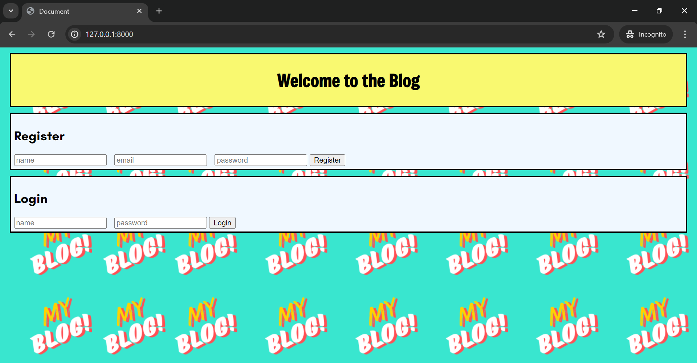
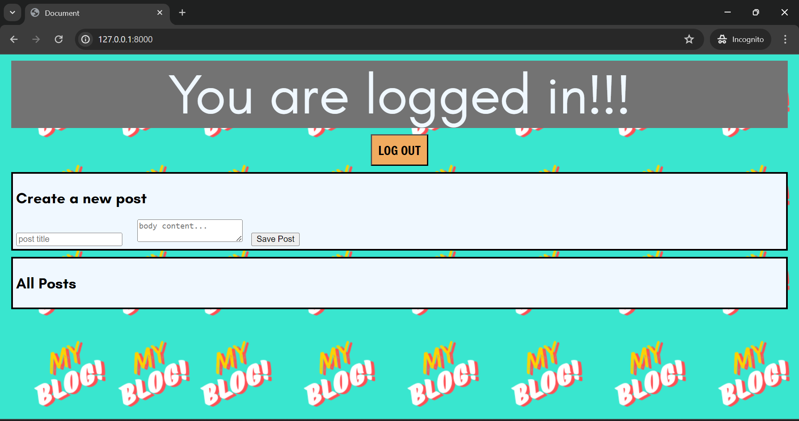
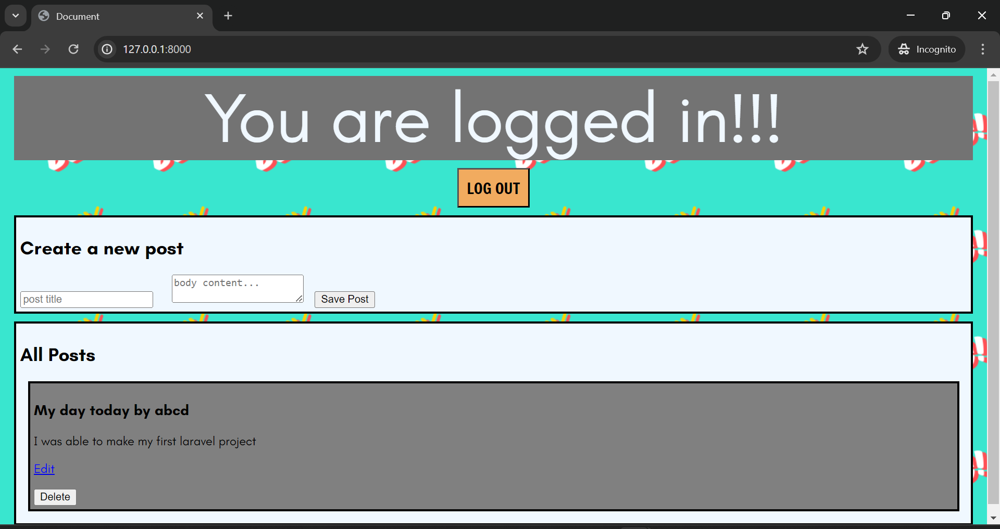

# Spending Tracker

Download the application [here](https://github.com/Akshaya21513/Spending-Tracker/releases).

**Budget Management App using Java**: This Budget Management App, developed in Java and integrated with MySQL database, offers efficient spending tracking and analysis capabilities.

**Development Environment**: Implemented with Java NetBeans IDE.

**Features Implemented**:
- **Spending Tracker**: Users can easily view all spending records.
- **Category Management**: Enables categorization by material or date for better organization and analysis.
- **Database Integration using MySQL**: Optimized database schema for storing spending data efficiently. This integration facilitates user preferences in data formatting and provides valuable insights into total spending.
- **User Interface (UI)**: UI using Java Swing for a seamless and user-friendly experience.

---

#### Screenshots:

<table>
   <tr>
      <td align="center"></td>
   </tr> 
</table> 
<table>
  <tr>
    <td align="center"></td>
    <td align="center"></td>
</table>
---

